# Debug build

Workflow that builds the app in debug mode for Android and iOS.

This workflow can be triggered by other workflows depending on it.

:::info
Additionally, Debug build workflow is triggered every time new code is pushed to `main` branch 
for caching purposes. This way, every branch will be able to use the cached build. More information about cache scoping can be found here: 
[GitHub Docs: Matching a cache key](https://docs.github.com/en/actions/writing-workflows/choosing-what-your-workflow-does/caching-dependencies-to-speed-up-workflows#matching-a-cache-key).
:::

## Usage 

This workflow cannot be explicitly specified to be generated using SCI. It will be generated automatically
if you choose to create workflow depending on it.

## Detailed behavior

Below you can find detailed information about what the script does with your project when generating Debug Build workflow.

### Fingerprint

This workflow takes advantage from the fact that debug builds need to be remade only if native code changes.

It uses [@expo/fingerprint](https://expo.dev/blog/fingerprint-your-native-runtime) to generate 
a hash string of your native code (called _fingerprint_) to cache debug builds and create new 
builds only if necessary.

This logic is extracted to auxiliary reusable workflow `lookup-cached-debug-build`. You can find more
information about it here: [Lookup cached debug build](/docs/aux-workflows/lookup-cached-debug-build).

### Caching

Built apps will be cached using [actions/cache](https://github.com/actions/cache) using keys 
`android-debug-build-${{ android-fingerprint }}` and 
`ios-debug-build-${{ ios-fingerprint }}` (fingerprints for Android and iOS apps are different).

Note that this save a significant amount of time and resources, since changes in native code
are relatively rare when developing a React Native app.

### Modified and created files

<table>
  <tr>
    <th style={{ width: "40%" }}>File</th>
    <th>Changes</th>
  </tr>
  <tr>
    <td><code>.github/workflows/build-debug-android.yml</code></td>
    <td>Contains the CI workflow for building debug Android app</td>
  </tr>
  <tr>
    <td><code>.github/workflows/build-debug-ios.yml</code></td>
    <td>Contains the CI workflow for building debug iOS app</td>
  </tr>
  <tr>
    <td><code>package.json</code></td>
    <td>
      <ul>
        <li>
          New script: 
          <code>
            build:debug:android: npx expo prebuild && cd android && 
            ./gradlew assembleDebug -DtestBuildType=debug
            -Dorg.gradle.jvmargs=-Xmx4g
          </code>
           
          (<code>npx expo prebuild</code> is ommited in non-Expo projects)
        </li>
        <li>
          New script: 
          <code>
            build:debug:ios: npx expo prebuild && xcodebuild ONLY_ACTIVE_ARCH=YES
            -workspace ios/[iOSAppName].xcworkspace -UseNewBuildSystem=YES
            -scheme [iOSAppName] -configuration Debug -sdk iphonesimulator
            -derivedDataPath ios/build -quiet
          </code>
           
          (<code>npx expo prebuild</code> is replaced with <code>cd ios && pod install && cd..</code> in non-Expo projects)
           
          (<code>[iOSAppName]</code> is replaced with the name of the iOS app retrieved from native code)
        </li>
      </ul>
    </td>
  </tr>
  <tr>
    <td><code>app.json</code></td>
    <td>
      Fields <code>expo.android.package</code> and <code>expo.ios.bundleIdentifier</code> will be created
      in Expo projects if not detected (they are needed for <code>npx expo prebuild</code>)
    </td>
  </tr>
</table>

### Workflow details

#### build-debug-android

The following diagram represents the flow of the `build-debug-android` workflow:

```mermaid
flowchart TD;
    A["🔍 Lookup cached debug build (and skip all following steps if found)\nUsing <a href='/setup-ci/docs/aux-workflows/lookup-cached-debug-build'>lookup-cached-debug-build</a>"]-->B["💾 Maximize build space\nUsing <a href='https://github.com/AdityaGarg8/remove-unwanted-software'>AdityaGarg8/remove-unwanted-software</a>"]
    B-->C["🌿 Setup Node"];
    C-->D["☕ Setup JDK 17"]
    D-->E["🐘 Setup Gradle 8.8"]
    E-->F["📦 Install dependencies"];
    F-->G["🛠️ Build [yarn build:debug:android]"]
    G-->H["📡 Store built app in cache"]
```

#### build-debug-ios

The following diagram represents the flow of the `build-debug-ios` workflow:

```mermaid
flowchart TD;
    A["🔍 Lookup cached debug build (and skip all following steps if found)\nUsing <a href='/setup-ci/docs/aux-workflows/lookup-cached-debug-build'>lookup-cached-debug-build</a>"]-->B["💾 Maximize build space\nUsing <a href='https://github.com/AdityaGarg8/remove-unwanted-software'>AdityaGarg8/remove-unwanted-software</a>"]
    B-->C["🌿 Setup Node"];
    C-->D["🔨 Use latest stable Xcode"]
    D-->E["📦 Install dependencies"];
    E-->F["🛠️ Build [yarn build:debug:ios]"]
    F-->G["📡 Store built app in cache"]
```

## Known issues and limitations

- One of limitations of GitHub Actions is that cache is scoped and cannot be accessed between 
  arbitrary branches (see [#79](https://github.com/actions/cache/issues/79)). This means that 
  if a build with specific fingerprint is created on `feature-a` branch, then in `feature-b` 
  branch with the same fingerprint, the build is not visible and the app will be built again.
  However, since the build is also created on main branch, once either `feature-a` or `feature-b`
  is merged to main, the build will be cached and available for all existing and future branches in the repository.
