# Release build

Workflow that build the app in release mode for Android and iOS.

This workflow can be triggered by other workflows depending on it.

## Usage 

This workflow cannot be explicitly specified to be generated using SCI. It will be generated automatically
if you choose to create workflow depending on it.

## Detailed behavior

Below you can find detailed information about what the script does with your project when generating Release Build workflow.

### Caching

Built apps will be cached using [actions/cache](https://github.com/actions/cache) using keys 
`android-release-build-${{ github.event.pull_request.head.sha }}` and 
`ios-release-build-${{ github.event.pull_request.head.sha }}`.

`${{ github.event.pull_request.head.sha }}` will evaluate to SHA of last commit on feature branch in Pull Request.

Note that the objective of this caching mechanism is not to optimize and reuse builds (this is only 
possible with debug builds), but rather to allow retrieving built app in other workflows.

### Modified and created files

<table>
  <tr>
    <th style={{ width: "40%" }}>File</th>
    <th>Changes</th>
  </tr>
  <tr>
    <td><code>.github/workflows/build-release-android.yml</code></td>
    <td>Contains the CI workflow for building release Android app</td>
  </tr>
  <tr>
    <td><code>.github/workflows/build-release-ios.yml</code></td>
    <td>Contains the CI workflow for building release iOS app</td>
  </tr>
  <tr>
    <td><code>package.json</code></td>
    <td>
      <ul>
        <li>
          New script: 
          <code>
            build:release:android: npx expo prebuild && cd android && 
            ./gradlew assembleRelease assembleAndroidTest -DtestBuildType=release 
            -Dorg.gradle.jvmargs=-Xmx4g
          </code>
           
          (<code>npx expo prebuild</code> is ommited in non-Expo projects)
        </li>
        <li>
          New script: 
          <code>
            build:release:ios: npx expo prebuild && xcodebuild ONLY_ACTIVE_ARCH=YES
            -workspace ios/[iOSAppName].xcworkspace -UseNewBuildSystem=YES
            -scheme [iOSAppName] -configuration Release -sdk iphonesimulator
            -derivedDataPath ios/build -quiet
          </code>
           
          (<code>npx expo prebuild</code> is replaced with <code>cd ios && pod install && cd..</code> in non-Expo projects)
           
          (<code>[iOSAppName]</code> is replaced with the name of the iOS app retrieved from native code)
        </li>
      </ul>
    </td>
  </tr>
  <tr>
    <td><code>app.json</code></td>
    <td>
      Fields <code>expo.android.package</code> and <code>expo.ios.bundleIdentifier</code> will be created
      in Expo projects if not detected (they are needed for <code>npx expo prebuild</code>)
    </td>
  </tr>
</table>

### Workflow details

#### build-release-android

The following diagram represents the flow of the `build-release-android` workflow:

```mermaid
flowchart TD;
    A["💾 Maximize build space\nUsing <a href='https://github.com/AdityaGarg8/remove-unwanted-software'>AdityaGarg8/remove-unwanted-software</a>"]-->B["🌿 Setup Node"];
    B-->C["📦 Install dependencies"];
    C-->D["☕ Setup JDK 17"]
    D-->E["🐘 Setup Gradle 8.8"]
    E-->F["🛠️ Build [yarn build:release:android]"]
    F-->G["📡 Store built app in cache"]
```

#### build-release-ios

The following diagram represents the flow of the `build-release-ios` workflow:

```mermaid
flowchart TD;
    A["🌿 Setup Node"]-->B["📦 Install dependencies"];
    B-->C["🔨 Use latest stable Xcode"]
    C-->D["🛠️ Build [yarn build:release:ios]"]
    D-->E["📡 Store built app in cache"]
```

