# Lookup cached debug build

Workflow that calculates the [fingerprint](https://expo.dev/blog/fingerprint-your-native-runtime) of the app and 
checks whether a debug build with the same fingerprint is cached and can be retrieved.

This workflow can be triggered by other workflows depending on it.

## Usage 

This workflow cannot be explicitly specified to be generated using SCI. It will be generated automatically
if you choose to create workflow depending on it.

## Detailed behavior

Below you can find detailed information about what the script 
does with your project when generating Lookup cached debug build workflow.

### Input and output

Input:
- `platform: ('android' | 'ios')` - The platform for which the build should be looked up

Output:
- `build-exists: boolean` - whether the build was found in cache
- `fingerprint: string` - the fingerprint calculated for specified platform

### Fingerprint

This workflow uses [@expo/fingerprint](https://expo.dev/blog/fingerprint-your-native-runtime) to generate 
a hash string of your native code (called _fingerprint_). It then checks whether key 
`${{ inputs.platform }}-debug-build-${{ fingerprint }}` can be restored from cache.

### Modified and created files

<table>
  <tr>
    <th style={{ width: "40%" }}>File</th>
    <th>Changes</th>
  </tr>
  <tr>
    <td><code>.github/workflows/lookup-cached-debug-build.yml</code></td>
    <td>Contains the CI workflow.</td>
  </tr>
  <tr>
    <td><code>package.json</code></td>
    <td>
      <ul>
        <li>
          New script: 
          <code>
            fingerprint:android: npx expo-updates fingerprint:generate 
            --platform android | jq -r '.hash' | xargs -n 1 echo 'fingerprint:'
          </code>
        </li>
        <li>
          New script: 
          <code>
            fingerprint:ios: npx expo-updates fingerprint:generate 
            --platform ios | jq -r '.hash' | xargs -n 1 echo 'fingerprint:'
          </code>
        </li>
      </ul>
    </td>
  </tr>
</table>

### Workflow details

#### build-debug-android

The following diagram represents the flow of the `lookup-cached-debug-build` workflow:

```mermaid
flowchart LR;
    A["🌿 Setup Node"]-->B["📦 Install dependencies"];
    B-->C["🧬 Calculate fingerprint"];
    C-->D["🐛 Lookup debug build in cache"];
```

