# Detox

Set up workflow to run Detox E2E tests for every Pull Request.

Learn more about Detox: [wix.github.io/Detox](https://wix.github.io/Detox/)

## Usage

```bash
npx setup-ci --preset --detox
```

## Detailed behavior

Below you can find detailed information about what the script does with your project when generating Detox workflow.

### Installed dependencies

- `detox` (dev)
- `jest` (dev)
- `typescript` (dev)
- `ts-jest` (dev)
- `@types/jest` (dev)
- `@config-plugins/detox` (dev) (if project uses Expo)

### Manual native code patch

If your project is not using Expo, you will have to manually patch the native code to make Detox work. 
SCI will provide you with the necessary instructions. Specifically, it will ask you to follow step 4 from
[Detox project setup](https://wix.github.io/Detox/docs/next/introduction/project-setup/#step-4-additional-android-configuration).

### Release build workflow

To test the app with Detox, we need to first build the app in release mode. Therefore, apart from 
CI workflow to run Detox tests, SCI will generate workflows for building the app, on which the Detox
workflow depends. You can read more about the release build workflow in [Release build](/docs/aux-workflows/build-release).

### Modified and created files

<table>
  <tr>
    <th style={{ width: "40%" }}>File</th>
    <th>Changes</th>
  </tr>
  <tr>
    <td><code>.github/workflows/test-detox-android.yml</code></td>
    <td>Contains the CI workflow for Detox on Android</td>
  </tr>
  <tr>
    <td><code>.github/workflows/test-detox-ios.yml</code></td>
    <td>Contains the CI workflow for Detox on iOS</td>
  </tr>
  <tr>
    <td><code>package.json</code></td>
    <td>
      <ul>
        <li>Missing dependencies are added</li>
        <li>New script: <code>detox:test:android: detox test --config-path .detoxrc-ci.js --configuration android.emu.release --cleanup</code></li>
        <li>New script: <code>detox:test:ios: detox test --config-path .detoxrc-ci.js --configuration ios.sim.release --cleanup</code></li>
      </ul>
    </td>
  </tr>
  <tr>
    <td><code>app.json</code></td>
    <td>
      Add <code>@config-plugins/detox</code> to <code>expo.plugins</code> if project uses Expo
      (if <code>app.config.js</code> is detected instead, SCI will prompt you to add it manually)
    </td>
  </tr>
  <tr>
    <td><code>.detoxrc-ci.js</code></td>
    <td>
      Created with Detox configuration for CI 
    </td>
  </tr>
  <tr>
    <td><code>e2e/jest.config.js</code></td>
    <td>
      Jest configuration for Detox, created if no <code>e2e</code> directory is detected 
    </td>
  </tr>
  <tr>
    <td><code>e2e/starter.test.ts</code></td>
    <td>
      Example Detox test, created if no <code>e2e</code> directory is detected
    </td>
  </tr>
</table>

### Workflow details

#### test-detox-android

The following diagram represents the flow of `test-detox-android` workflow:

```mermaid
flowchart TD;
    A["⌛ Wait for release build to finish\nUsing <a href='/setup-ci/docs/aux-workflows/build-release'>build-release</a>"]-->B["🌿 Setup Node"];
    B-->C["📦 Install dependencies"];
    C-->D["☕ Setup JDK 17"]
    D-->E["🐘 Setup Gradle 8.8"]
    E-->F["🐛 Restore release build from cache"]
    F-->G["🏎️ Enable KVM\n<a href='https://github.com/ReactiveCircus/android-emulator-runner?tab=readme-ov-file#running-hardware-accelerated-emulators-on-linux-runners'>Learn more</a>"]
    G-->H["📱 AVD cache\n<a href='https://github.com/ReactiveCircus/android-emulator-runner?tab=readme-ov-file#usage--examples'>Learn more</a>"]
    H-->I["📋 Run Detox tests [yarn detox:test:android]\nUsing <a href='https://github.com/ReactiveCircus/android-emulator-runner'>Android Emulator Runner</a>"]
```



#### test-detox-ios

The following diagram represents the flow of `test-detox-ios` workflow:

```mermaid
flowchart TD;
    A["⌛ Wait for release build to finish\nUsing <a href='/setup-ci/docs/aux-workflows/build-release'>build-release</a>"]-->B["🌿 Setup Node"];
    B-->C["📦 Install dependencies"];
    C-->D["🐛 Restore release build from cache"]
    D-->E["📋 Run Detox tests [yarn detox:test:ios]"]
```



## Known issues and limitations

- Currently Detox tests are run on release builds. This means that the app will have to be built
  every time the code changes (native or JS). This can be time-consuming and if you would like 
  to save this time, consider using [Maestro workflow](/docs/workflows/maestro) which is run 
  on debug build. This allows for caching and rebuilding the app only if native code changes,
  which results in significant resource and time savings.
