# EAS Preview

Set up workflow to run EAS Preview for every Pull Request.

:::caution
Currently SCI can generate EAS Preview workflow in Expo projects only.
:::

This workflow is meant to integrate your app with [expo.dev](https://expo.dev/).
It uses [Expo continuous-deploy-fingerprint action](https://github.com/expo/expo-github-action/tree/main/continuous-deploy-fingerprint)
to publish EAS Updates and trigger EAS Builds in development profile 
when the fingerprint of the app changes. You can learn more with Expo documentation on
[EAS Build](https://docs.expo.dev/build/introduction),
[EAS Update](https://docs.expo.dev/eas-update/introduction) and
[Expo fingerprint](https://expo.dev/blog/fingerprint-your-native-runtime).

Additionally, a comment will be created in your PR with a link to the build 
and a QR code to scan and open the app on your device with the latest update:


## Usage

```bash
npx setup-ci --preset --eas
```

## Detailed behavior

Below you can find detailed information about what the script does with your project when generating EAS Preview workflow.

### Installed dependencies

- `expo`
- `expo-dev-client`
- `expo-updates`

### Expo token

This workflow communicated with [expo.dev](https://expo.dev/) and needs to authenticate with your Expo account.
Therefore, you will be prompted to provide an Expo token as repository secret. You can learn more 
about using Expo with GitHub actions in [Expo with GitHub actions](https://docs.expo.dev/eas-update/github-actions).

### App credentials

SCI will ask you whether you want to configure credentials for signing apps built with EAS Build.
This step is free for Android app, but to setup credentials for iOS you need a paid Apple Developer account.
If you skip this step, your iOS builds will only be able to be run on iOS simulator. 
You can learn more at [App credentials](https://docs.expo.dev/app-signing/app-credentials/).

### Modified and created files

<table>
  <tr>
    <th style={{ width: "40%" }}>File</th>
    <th>Changes</th>
  </tr>
  <tr>
    <td><code>.github/workflows/eas.yml</code></td>
    <td>Contains the CI workflow</td>
  </tr>
  <tr>
    <td><code>package.json</code></td>
    <td>Missing dependencies are added</td>
  </tr>
  <tr>
    <td><code>app.json</code></td>
    <td>
      Set <code>expo.runtimeVersion.policy</code> to <code>fingerprint</code>
      (if <code>app.config.js</code> is detected, you will be prompted to do it manually)
    </td>
  </tr>
  <tr>
    <td><code>eas.json</code></td>
    <td>
      Created with basic EAS configuration if not detected
    </td>
  </tr>
</table>

### Workflow details

The following diagram represents the flow of EAS Preview workflow:

```mermaid
flowchart TD;
    A["🌿 Setup Node"]-->B["Λ Setup EAS\nUsing <a href='https://github.com/expo/expo-github-action'>expo/expo-github-action</a>"]
    B-->C["📦 Install dependencies"];
    C-->D["🚀 Create Preview with EAS Build and Update\nUsing <a href='https://github.com/expo/expo-github-action/tree/main/continuous-deploy-fingerprint'>expo/expo-github-action/continuous-deploy-fingerprint</a>"]
```



## Known issues and limitations

- Currently SCI can generate EAS Preview workflow in Expo projects only.
