# ESLint

Set up workflow to run ESLint check on your code for every Pull Request. 

Learn more about ESLint: [eslint.org](https://eslint.org/)

## Usage

```bash
npx setup-ci --preset --lint
```

## Detailed behavior

Below you can find detailed information about what the script does with your project when generating ESLint workflow.

### Installed dependencies

- `eslint` (dev)
- `typescript` (dev)
- `@react-native/eslint-config` (dev)
- `eslint-plugin-prettier` (dev) (if Prettier is selected or already installed)
- `eslint-config-prettier` (dev) (if Prettier is selected or already installed)

### Modified and created files

<table>
  <tr>
    <th style={{ width: "40%" }}>File</th>
    <th>Changes</th>
  </tr>
  <tr>
    <td><code>.github/workflows/lint.yml</code></td>
    <td>Contains the CI workflow</td>
  </tr>
  <tr>
    <td><code>package.json</code></td>
    <td>
      <ul>
        <li>Missing dependencies are added</li>
        <li>New script: <code>lint: eslint "**/*.&#123;js,jsx,ts,tsx&#125;"</code></li>
      </ul>
    </td>
  </tr>
  <tr>
    <td><code>.eslintrc.json</code></td>
    <td>
      Created if no existing ESLint configuration was detected
      (contains configuration compatible with Prettier if
      it is already installed or Prettier workflow was selected)
    </td>
  </tr>
</table>

### Workflow details

The following diagram represents the flow of the ESLint CI workflow:

```mermaid
flowchart LR;
    A["🌿 Setup Node"]-->B["📦 Install dependencies"];
    B-->C["🤓 Run ESLint [yarn lint]"];
```



## Known issues and limitations

- Sometimes dependencies cannot be installed automatically due to peer dependencies conflicts
  with already installed packages. In such cases, you will need to resolve the conflicts manually.
- The `.eslintrc.json` configuration file generated by SCI might not be well tailored to your project.
  You will have to adjust it manually if needed.
