# Maestro

Set up workflow to run Maestro E2E tests for every Pull Request.

Learn more about Maestro: [maestro.mobile.dev](https://maestro.mobile.dev/)

## Usage

```bash
npx setup-ci --preset --maestro
```

## Detailed behavior

Below you can find detailed information about what the script does with your project when generating Maestro workflow.

### Installed dependencies

Since Maestro is a CLI tool, it requires no additional dependencies to be installed!

### Debug build workflow

To test the app with Maestro, we need to first build the app in debug mode. Therefore, apart from 
CI workflow to run Maestro tests, SCI will generate workflows for building the app, on which the Maestro
workflow depends. You can read more about the debug build workflow in [Debug build](/docs/aux-workflows/build-debug).

### Modified and created files

<table>
  <tr>
    <th style={{ width: "40%" }}>File</th>
    <th>Changes</th>
  </tr>
  <tr>
    <td><code>.github/workflows/maestro-test-android.yml</code></td>
    <td>Contains the CI workflow for Maestro on Android</td>
  </tr>
  <tr>
    <td><code>.github/workflows/maestro-test-ios.yml</code></td>
    <td>Contains the CI workflow for Maestro on iOS</td>
  </tr>
  <tr>
    <td><code>package.json</code></td>
    <td>
      New script: <code>maestro:test: maestro test --debug-output maestro-debug-output .maestro</code>  
    </td>
  </tr>
  <tr>
    <td><code>.maestro/example-flow.yml</code></td>
    <td>
      Example Maestro test, created if no <code>.maestro</code> directory is detected
    </td>
  </tr>
</table>

### Workflow details

#### maestro-test-android

The following diagram represents the flow of `maestro-test-android` workflow:

```mermaid
flowchart TD;
    A["⌛ Wait for debug build to finish\nUsing <a href='/setup-ci/docs/aux-workflows/build-debug'>build-debug</a>"]-->B["🐛 Restore debug build from cache"];
    B-->C["🌿 Setup Node"];
    C-->D["☕ Setup JDK 17"]
    D-->E["🐘 Setup Gradle 8.8"]
    E-->F["📦 Install dependencies"];
    F-->G["🏎️ Enable KVM\n<a href='https://github.com/ReactiveCircus/android-emulator-runner?tab=readme-ov-file#running-hardware-accelerated-emulators-on-linux-runners'>Learn more</a>"]
    G-->H["📱 AVD cache\n<a href='https://github.com/ReactiveCircus/android-emulator-runner?tab=readme-ov-file#usage--examples'>Learn more</a>"]
    H-->I["🚇 Run Metro bundler in the background [yarn start]\n(Must be run since we test on debug build)"]
    I-->J["🧪 Run Maestro tests [yarn maestro:test]\nUsing <a href='https://github.com/ReactiveCircus/android-emulator-runner'>Android Emulator Runner</a>"]
    J-->K["📤 Store debug output if failed\nUsing <a href='https://github.com/actions/upload-artifact'>actions/upload-artifact</a>"]
```



#### maestro-test-ios

The following diagram represents the flow of `maestro-test-ios` workflow:

```mermaid
flowchart TD;
    A["⌛ Wait for debug build to finish\nUsing <a href='/setup-ci/docs/aux-workflows/build-debug'>build-debug</a>"]-->B["🐛 Restore debug build from cache"];
    B-->C["🌿 Setup Node"];
    C-->D["☕ Setup JDK 17\n(Java is a dependency of Maestro)"]
    D-->E["📦 Install dependencies"];
    E-->F["📱 Boot iOS simulator"]
    F-->G["🚇 Run Metro bundler in the background [yarn start]\n(Must be run since we test on debug build)"]
    G-->H["🧪 Run Maestro tests [yarn maestro:test]"]
    H-->I["📤 Store debug output if failed\nUsing <a href='https://github.com/actions/upload-artifact'>actions/upload-artifact</a>"]
```



## Known issues and limitations

- Maestro drives sometimes fails to start on `macos` GitHub Actions runners. This is a known open issue,
  you can follow it here: [#1585](https://github.com/mobile-dev-inc/maestro/issues/1585)
