# Prettier check

Set up workflow to run Prettier check on your code for every Pull Request.

Learn more about Prettier: [prettier.io](https://prettier.io/)

## Usage

```bash
npx setup-ci --preset --prettier
```

## Detailed behavior

Below you can find detailed information about what the script does with your project when generating Prettier check workflow.

### Installed dependencies

- `prettier` (dev)

### Modified and created files

<table>
  <tr>
    <th style={{ width: "40%" }}>File</th>
    <th>Changes</th>
  </tr>
  <tr>
    <td><code>.github/workflows/prettier.yml</code></td>
    <td>Contains the CI workflow</td>
  </tr>
  <tr>
    <td><code>package.json</code></td>
    <td>
      <ul>
        <li>Missing dependencies are added</li>
        <li>New script: <code>prettier:check: prettier --check "**/*.&#123;ts,tsx,js,jsx,json,css,scss,md&#125;"</code></li>
        <li>New script: <code>prettier:write: prettier --write "**/*.&#123;ts,tsx,js,jsx,json,css,scss,md&#125;"</code></li>
      </ul>
    </td>
  </tr>
  <tr>
    <td><code>.prettierrc</code></td>
    <td>
      Created if no Prettier configuration was detected.
    </td>
  </tr>
</table>

### Workflow details

The following diagram represents the flow of the Prettier check CI workflow:

```mermaid
flowchart LR;
    A["🌿 Setup Node"]-->B["📦 Install dependencies"];
    B-->C["✨ Run Prettier check [yarn prettier:check]"];
```



## Known issues and limitations

- The `.prettierrc` configuration file generated by SCI might not be well tailored to your project.
  You will have to adjust it manually if needed.
