# Typescript check

Set up workflow to run Typescript check on your code to detect compilation errors for every Pull Request.

Learn more about Typescript: [typescriptlang.org](https://www.typescriptlang.org/)

## Usage

```bash
npx setup-ci --preset --ts
```

## Detailed behavior

Below you can find detailed information about what the script does with your project when generating Typescript check workflow.

### Installed dependencies

- `typescript` (dev)

### Modified and created files

<table>
  <tr>
    <th style={{ width: "40%" }}>File</th>
    <th>Changes</th>
  </tr>
  <tr>
    <td><code>.github/workflows/typescript.yml</code></td>
    <td>Contains the CI workflow</td>
  </tr>
  <tr>
    <td><code>package.json</code></td>
    <td>
      <ul>
        <li>Missing dependencies are added</li>
        <li>New script: <code>ts:check: tsc -p . --noEmit</code></li>
      </ul>
    </td>
  </tr>
  <tr>
    <td><code>tsconfig.json</code></td>
    <td>
      Created if no <code>tsconfig.json</code> was detected.
    </td>
  </tr>
</table>

### Workflow details

The following diagram represents the flow of the Typescript check CI workflow:

```mermaid
flowchart LR;
    A["🌿 Setup Node"]-->B["📦 Install dependencies"];
    B-->C["🔍 Run Typescript check [yarn ts:check]"];
```



## Known issues and limitations

- The `tsconfig.json` configuration file generated by SCI might not be well tailored to your project.
  You will have to adjust it manually if needed.
