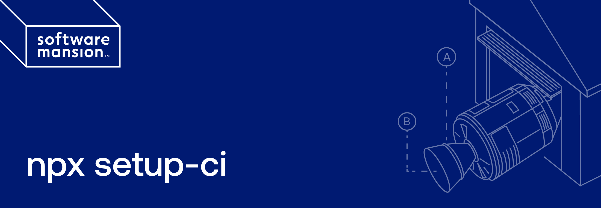

## 🤔 Why?

The problem we noticed is that setting up CI is performed once, needs to be researched every time, and is often trial and error driven. The process is repetitive.

We created a tool that bootstraps CI with the most used features, which are ready for customization in the future. Running `npx setup-ci` generates GitHub workflows for the most popular CI tasks.

## 📖 Usage

Simply go to your project root directory and run:

```
npx setup-ci
```

then select the setup that matches your project - `npx setup-ci` generates workflows and tries to add missing configs and install necessary dependencies.

If your project has a monorepo structure, run the script from the root directory of the app for which you want to set up workflows.

> [!WARNING]
> If you re-run `npx setup-ci` in the same project or you already have some workflows set up manually, they might get overwritten. Therefore we recommend running the script with no uncommited changes, so you can easily inspect the diff after script execution.

## 💡 Demo

Say we want to set up GitHub actions that run Typescript and Prettier checks on our project every time we create or push to an existing Pull Request.
Let's try to use `npx setup-ci` to do the heavy lifting and generate all the necessary configurations.

<p align="center">
  
</p>

Alternatively, we can use flags `--preset --ts --prettier` to avoid the interactive survey at the beginning of the script. You can check the section below for more information about available flags!

## ⚙️ Features

- **Currently, only GitHub actions are supported as your CI.**
- **npm** and **yarn** are supported as package managers, and they will be detected automatically.
- Monorepo structure is supported, but make sure you run the script from the app directory,
  not the monorepo root.

When using `npx setup-ci`, you can provide additional flags to modify its default behavior.

<table>
  <tr>
    <th width="160px" style="text-align: center; vertical-align: middle;">Flag</th>
    <th style="text-align: center; vertical-align: middle;">Description</th>
  </tr>
  <tr>
    <td style="vertical-align: middle;">--preset</td>
    <td style="vertical-align: middle;">Run the script with your own preset. Combine it with feature flags to specify what workflows you want to generate.</td>
  </tr>
  <tr>
    <td style="vertical-align: middle;">--skip-git-check</td>
    <td style="vertical-align: middle;">By default, the script will prompt the user if there are uncommitted changes in the working repository. Use this flag to proceed without asking.</td>
  </tr>
</table>

The following are **feature flags** that can be used with `--preset` flag (they are ignored if `--preset` is not provided).

<table>
  <tr>
    <th width="160px" style="text-align: center; vertical-align: middle;">Flag</th>
    <th style="text-align: center; vertical-align: middle;">Description</th>
  </tr>
  <tr>
    <td style="vertical-align: middle;">--lint</td>
    <td style="vertical-align: middle;">Generate ESLint workflow to run on every PR</td>
  </tr>
  <tr>
    <td style="vertical-align: middle;">--jest</td>
    <td style="vertical-align: middle;">Generate Jest workflow to run on every PR</td>
  </tr>
  <tr>
    <td style="vertical-align: middle;">--ts</td>
    <td style="vertical-align: middle;">Generate Typescript check workflow to run on every PR</td>
  </tr>
  <tr>
    <td style="vertical-align: middle;">--prettier</td>
    <td style="vertical-align: middle;">Generate Prettier check workflow to run on every PR</td>
  </tr>
  <tr>
    <td style="vertical-align: middle;">--eas</td>
    <td style="vertical-align: middle;">Generate Preview with EAS workflow to run on every PR <b>(Expo projects only)</b>. 
      The workflow uses <a href=https://github.com/expo/expo-github-action/tree/main/continuous-deploy-fingerprint>Expo continuous-deploy-fingerprint action</a>
      to publish EAS Updates and trigger EAS Builds in development profile 
      when the fingerprint of the app changes. You can learn more with Expo documentation on
      <a href=https://docs.expo.dev/build/introduction/>EAS Build</a>,
      <a href=https://docs.expo.dev/eas-update/introduction/>EAS Update</a>
      and <a href=https://expo.dev/blog/fingerprint-your-native-runtime>Expo fingerprint</a>.
      </br>
      Additionally, a comment will be created in your PR with a link to the build 
      and a QR code to scan and open the app on your device with the latest update.
    </td>
  </tr>
  <tr>
    <td style="vertical-align: middle;">--detox</td>
    <td style="vertical-align: middle;">Generate workflow to run Detox e2e tests on every PR</td>
  </tr>
  <tr>
    <td style="vertical-align: middle;">--maestro</td>
    <td style="vertical-align: middle;">Generate workflow to run Maestro e2e tests on every PR</td>
  </tr>
</table>

## 🔐 Repository secrets

Some workflows generated by `npx setup-ci` require setting up repository secrets that can be then accessed by workflows as `${{ secrets.* }}`. Make sure to read logs printed by the script
as you will always be prompted to create secrets if necessary. The following table shows a summary of secrets you might have to create for generated workflows to work properly.

<table>
  <tr>
    <td style="text-align: center; vertical-align: middle; font-weight: bold">Secret</td>
    <td style="text-align: center; vertical-align: middle; font-weight: bold">Description</td>
  </tr>
  <tr>
    <td style="vertical-align: middle;">EXPO_TOKEN</td>
    <td style="vertical-align: middle;">Used for authentication in workflows using your Expo account. Learn more at <a href=https://docs.expo.dev/eas-update/github-actions>Expo with GitHub actions</a>.</td>
  </tr>
</table>

## 💬 Your feedback

This tool is supposed to be helpful to as many developers as possible - and therefore we are open to your ideas and general feedback! If you want to share your opinion about `npx setup-ci` or
have some thoughts about how it could be further developed, don't hesitate to create an issue or contact
the maintainers directly.

## 🚸 Roadmap

- [x] Build Expo DevClient when fingerprint changes
- [x] Maestro support for E2E tests
- [ ] Different workflows for different branches (ex. PR, main, release)
- [ ] Upload source maps to Sentry
- [ ] Handle different vendors

## 📋 License

`npx setup-ci` is licensed under [The MIT License](LICENSE).

## 💸 Credits

This project has been built and is maintained thanks to the support from [Software Mansion](https://swmansion.com)

[](https://swmansion.com)

## `setup-ci` is created by Software Mansion

Since 2012 [Software Mansion](https://swmansion.com) is a software agency with experience in building web and mobile apps. We are Core React Native Contributors and experts in dealing with all kinds of React Native issues. We can help you build your next dream product – [Hire us](https://swmansion.com/contact/projects?utm_source=reanimated&utm_medium=readme).
